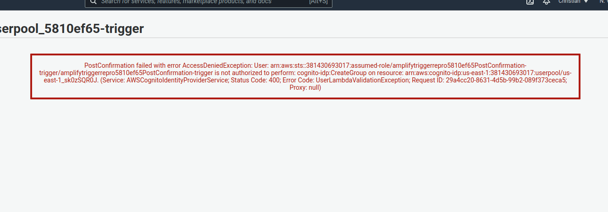

# Amplify auth failure repro

This project integrates Amplify sign-in into the NextJS starter template for
debugging.

In this demo, we will see that creating an Amplify project with the default auth
settings works fine, but as soon as you enable another feature, the user
experience will break completely, preventing sign-ups and other behavior from
working out-of-the-box.

## Instructions
1. `yarn` to install dependencies
2. `yarn dev` to start the Next dev server
3. `amplify init` to initialize new project
    1. Source dir: `src`
    2. Build dir: `out`
    3. Build command: `next build`
    4. Start command: `next start` 
4. `amplify add auth` to add auth (so Sign Up works)
    1. Default configuration
    2. Username
    3. No, I am done (will enable advanced settings later)
5. `amplify push` to push changes
    1. Creates Auth service
    2. Updates `aws-exports.js`
6. Go to [localhost:3000/login](http://localhost:3000/login)
    1. Create account
    2. **Success!**


Now, we will see what happens when we have more than one handler in the Auth
stack. We will redo this, except enable at least one other feature. It does not
matter which one.

1. `amplify remove auth` to remove the current auth (or restart from scratch)
2. `amplify add auth` to re-add auth
    1. Default configuration
    2. Username
    3. **Yes, I want to make additional changes.**
    4. [Enter]
    5. Select any from this list any hit [Enter]
3. Go to **Step 5** above, push changes, try to create an account.
4. **Sign-up process fails** (for one of two reasons, see below)    
    
When I originally reported this bug, the confirmation code would send
successfully and then, after confirming it, the client would receive a 400
error, stopping the sign-up process unless the user navigates to the homepage
and login manually.

Weirdly though, as of May 22, the confirmation code does not send at this step
for me (add-to-group feature enabled). Hitting "Resend Code" returns:

```none
{"__type":"NotAuthorizedException","message":"Cannot resend codes. Auto verification not turned on."}
```

Manually confirming the user in the Cognito dashboard displays the same old 400
error, which indicates the PostConfirmation add-user-to-group functionality is
"failing" despite actually working (it simply responds incorrectly).

